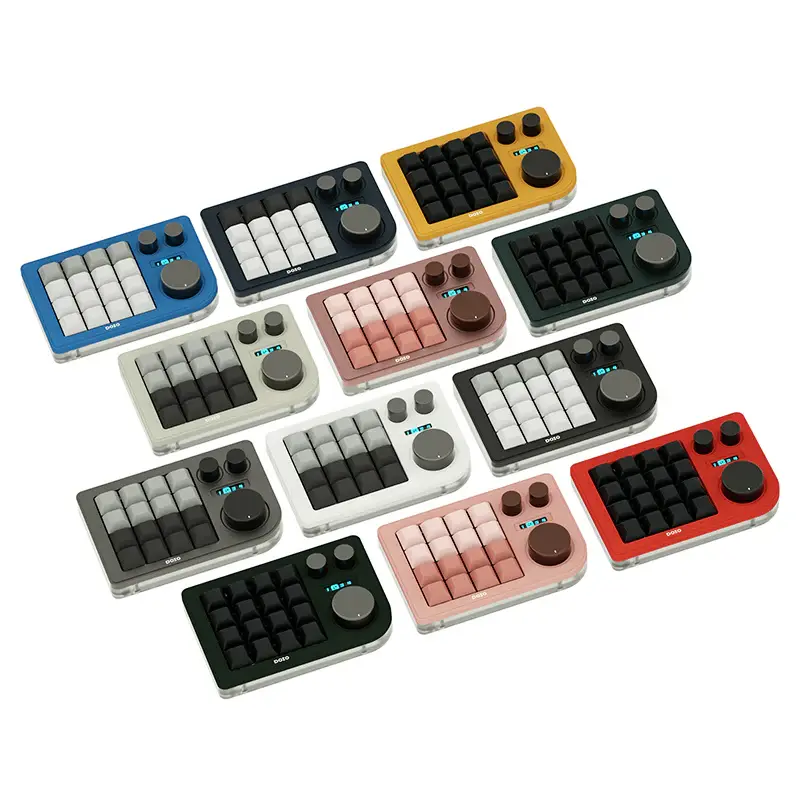
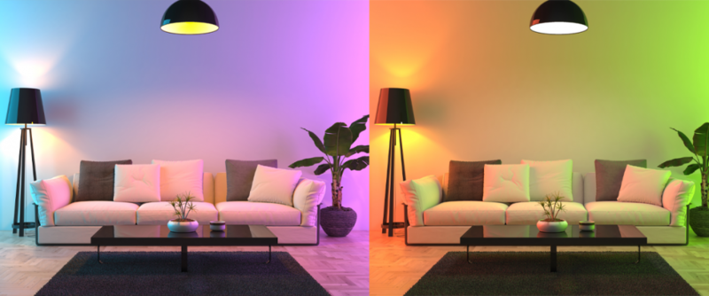

# DOIO Hue Controller

Control Philips Hue lights using the rotary encoders on a DOIO KB16 macro keyboard.





## Features

- **Knob 1** (small) → Control hue of Bulb 1
- **Knob 2** (small) → Control hue of Bulb 2
- **Knob 3** (large) → Control brightness of both bulbs
- Visual feedback: Keyboard RGB flashes the current bulb color
- Automatic backup/restore of keyboard RGB settings

## Hardware Requirements

- **DOIO KB16-01** macro keyboard ([official store](https://doioshop.com/products/doio-16-keys-programmable-multifunction-mechanical-keyboard-translucent-acrylic-kb16-01))
  - VIA compatible
  - 16 keys + 3 rotary encoders
- **Philips Hue Bridge**
- **Philips Hue Color bulbs** (2x recommended)

## Software Requirements

- Node.js 22+ (see `.nvmrc`)
- npm

## Getting Started

### 1. Clone the repository

```bash
git clone https://github.com/alexsorokoletov/DOIOKB16_HueLightsController.git
cd DOIOKB16_HueLightsController
```

### 2. Select Node version

Using [fnm](https://github.com/Schniz/fnm) (recommended):
```bash
fnm use
```

Or using [nvm](https://github.com/nvm-sh/nvm):
```bash
nvm use
```

### 3. Install dependencies

```bash
npm install
```

### 4. Configure your Hue Bridge

```bash
npm run setup
```

This will:
- Discover your Hue Bridge on the network
- Guide you through pressing the link button
- Let you select which bulbs to control
- Save configuration to `config.json`

### 5. Run the controller

```bash
npm start
```

The keyboard RGB will turn purple to indicate Hue control mode is active.

Press `Ctrl+C` to exit and restore original keyboard settings.

## Usage

| Control | Action |
|---------|--------|
| Small Knob 1 (left) | Rotate to change Bulb 1 hue |
| Small Knob 2 (right) | Rotate to change Bulb 2 hue |
| Large Knob (center) | Rotate to adjust brightness |

## How It Works

1. On start, the script backs up your keyboard's RGB settings
2. Sets keyboard to purple "Hue mode" indicator
3. Opens the HID Consumer interface to capture encoder events
4. Translates encoder rotations to Hue API calls
5. On exit, restores original keyboard RGB settings

The Consumer HID interface capture prevents volume/zoom side effects from reaching the OS.

## Troubleshooting

**Keyboard not found**
- Ensure DOIO KB16 is connected via USB
- Check that VIA can detect your keyboard at [usevia.app](https://usevia.app)

**Hue Bridge not found**
- Ensure bridge is on the same network
- Try running setup again: `npm run setup`

**Permission errors (macOS)**
- The app needs HID access permissions
- Go to System Preferences → Security & Privacy → Input Monitoring

## Test Scripts

Development and diagnostic scripts are in the `test/` folder. See [test/README.md](test/README.md) for details.

## License

MIT License - see [LICENSE](LICENSE)
